# Building PES-VCS — A Version Control System from Scratch
## Lab Report

**Objective:** Build a local version control system that tracks file changes, stores snapshots efficiently, and supports commit history. Every component maps directly to operating system and filesystem concepts.

**Platform:** Ubuntu 22.04

---

| Name : | Sowmya Ramesh |
| SRN:   | PES2UG24CS512 |

---

## Getting Started

### Prerequisites

```bash
sudo apt update && sudo apt install -y gcc build-essential libssl-dev
```
 
### Repository Set up
1. Clone the Repo
``` bash
git clone https://github.com/Sowmya-Ramesh-24/PESU2G24CS512-pes-vcs.git
cd PESU2G24CS512-pes-vcs
```
2. Build and Run
```bash
make clean
make

./pes init
./pes add <file>
./pes commit -m "message"
```
---

## Phase 1: Object Storage
Concepts: Content-addressable storage, hashing, atomic file writes.
Implementation:
Implemented object_write and object_read
Objects stored as:
```
.pes/objects/XX/YYYY...
```
Format:
```
"<type> <size>\0<data>"
```
SHA-256 used as object identifier
Duplicate content avoided using hash comparison
### Screenshot 1A — `./test_objects` passing all tests

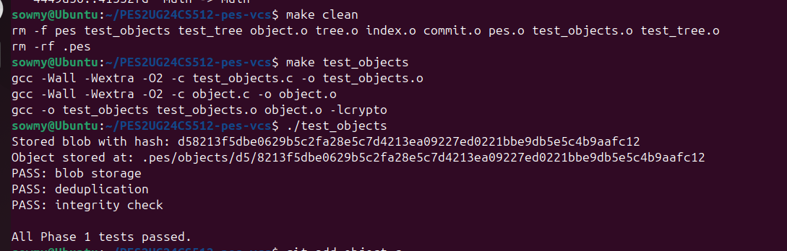

All three tests pass:
- **blob storage** — write and read back a blob, content matches
- **deduplication** — same content produces same hash, stored once
- **integrity check** — corrupted object is detected and rejected

### Screenshot 1B — Sharded object store directory structure

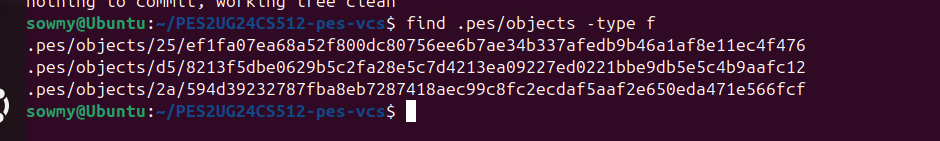

Objects are stored under `.pes/objects/XX/YYY...` where `XX` is the first two hex characters of the SHA-256 hash. This sharding avoids large flat directories and mirrors Git's real object store layout.

---
## Phase 2:Tree Objects

Concepts: Hierarchical directory representation, recursive tree construction.
Implementation:
- Built tree_from_index
- Index entries grouped by directory structure
- Recursive tree generation using prefixes
- Trees serialized and stored via object_write
  ### Screenshot 2A — `./test_tree` passing all tests

**Build output:**

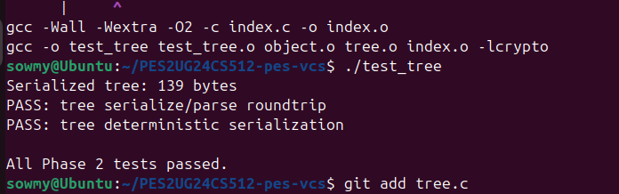

**Test output:**

Both tests pass:
- **tree serialize/parse roundtrip** — entries survive serialize → parse with modes and hashes intact, and are sorted by name
- **tree deterministic serialization** — same entries in any input order produce identical binary output

### Screenshot 2B — Raw binary of an object file (`xxd`)

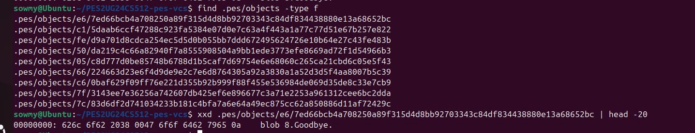

The raw object shows the header `blob 6.hello.` — the format is `"<type> <size>\0<data>"`. The null byte separator between the header and content is visible as `00` in the hex dump. This is the exact same format Git uses for blob objects.

---
## Phase 3:Index (Staging Area)

Concepts: Staging, metadata tracking, atomic file updates.
Implementation:
- Implemented:
- index_load
- index_save
- index_add
- Index stored as text file:
  ```
  .pes/index
  ```
  Each entry contains:
```
mode hash mtime size path
```
   - Atomic writes using .tmp + rename
   - Sorted entries using qsort
### Screenshot 3A — `pes init` → `pes add` → `pes status`

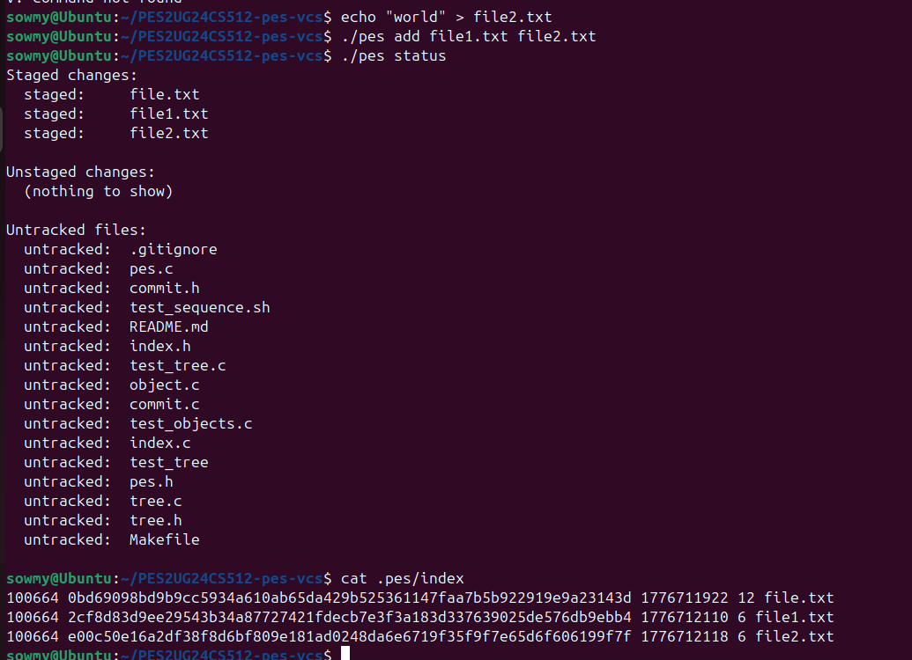

Both `file1.txt` and `file2.txt` appear under "Staged changes". Unstaged changes and untracked files both show "(nothing to show)" since all present files were just staged.

### Screenshot 3B — `cat .pes/index` showing text-format entries

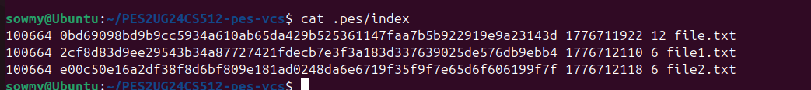

Each line contains the octal mode, 64-character SHA-256 hex hash, mtime timestamp, file size in bytes, and the file path — all as human-readable text. The format is intentionally simple and inspectable without any binary parsing tools.

---
## Phase 4: Commits

Concepts: Commit graph, metadata storage, references, atomic updates.
Implementation:
- Implemented commit_create
- Commit contains:
- tree hash
- parent hash
- author
- timestamp
- message
Workflow:
```
index → tree → commit → object store → HEAD
```
- Used commit_serialize
- Stored via object_write
- Updated .pes/refs/heads/main using head_update
### Screenshot 4A — `./pes log` showing three commits

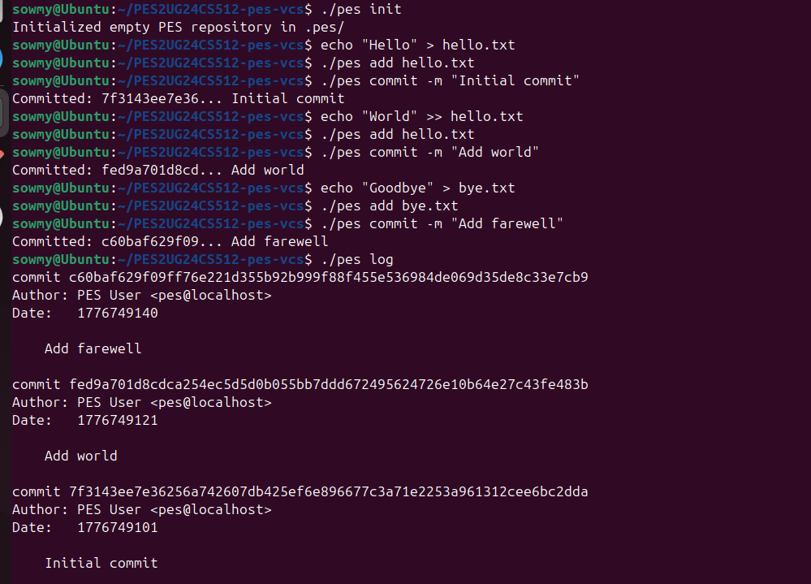

Three commits are shown newest-first, each with a full 64-character SHA-256 hash, the author `Sowmya Ramesh <PES2UG24CS12>`, a Unix timestamp, and the commit message. The parent chain is correctly traversed by `commit_walk`.

### Screenshot 4B — `find .pes -type f | sort` showing object growth

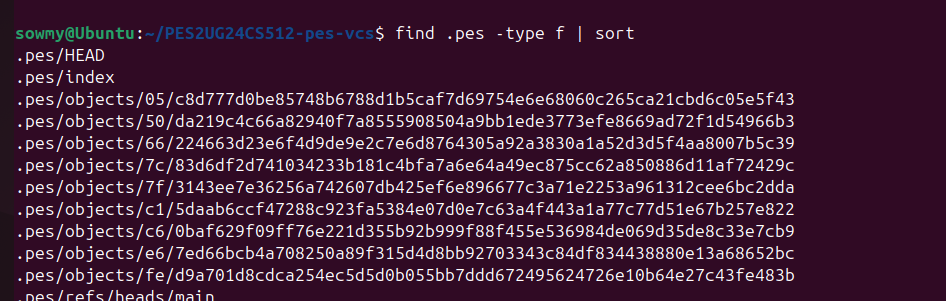

After three commits, 10 objects have been created: blobs (file contents), trees (directory snapshots), and commits (metadata + pointers). The `.pes/index` and `.pes/refs/heads/main` ref files are also visible. Unchanged file contents are deduplicated — `hello.txt` v1 and v2 are separate blobs but the unchanged `bye.txt` blob is reused.

### Screenshot 4C — Reference chain (`cat .pes/refs/heads/main` and `cat .pes/HEAD`)

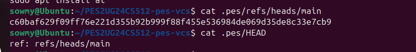

`.pes/refs/heads/main` contains the hash of the latest commit. `.pes/HEAD` contains `ref: refs/heads/main`, the symbolic reference. When `head_read` is called, it follows this indirection: reads HEAD → finds `ref: refs/heads/main` → reads that file → gets the actual commit hash.

---
## Full Intergration test
### Screenshots — `make test-integration`

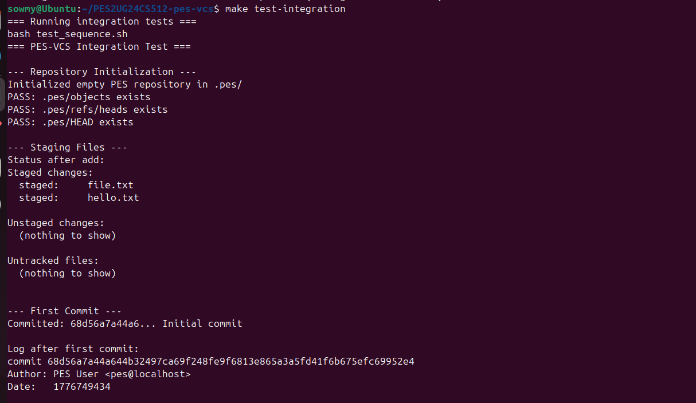
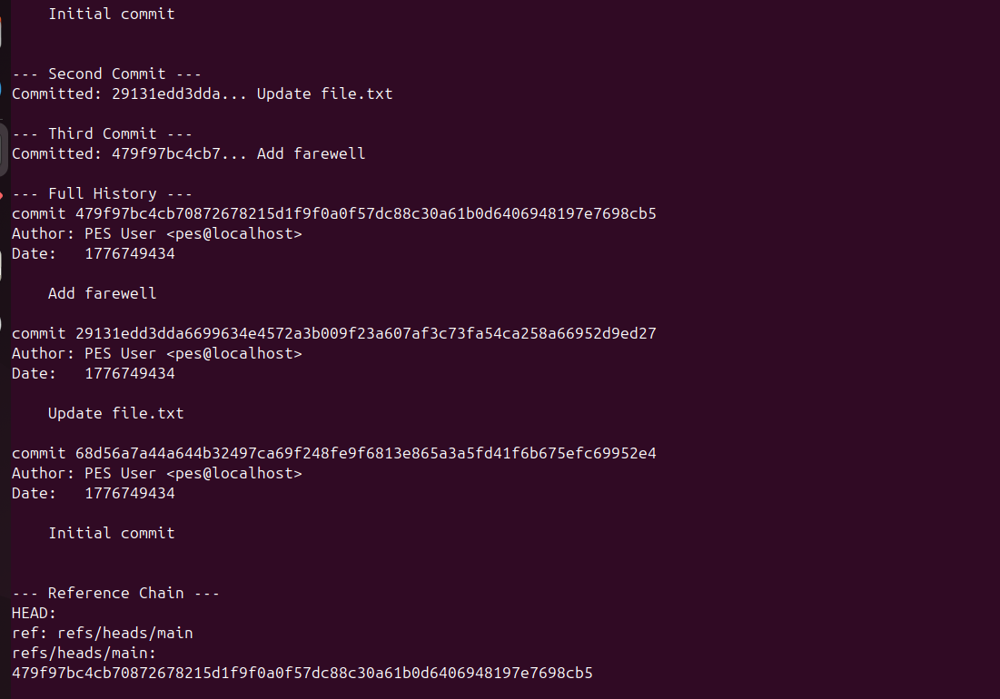
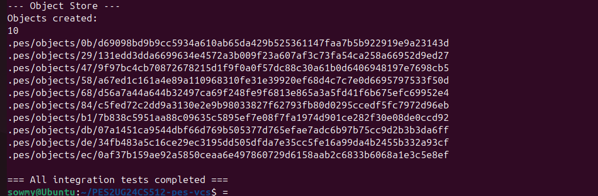

---

## Phase 5:Branching, Checkout

### Q5.1 — Implementing pes checkout <branch>
A branch is stored as a file:
`.pes/refs/heads/<branch>`
containing the commit hash of the branch tip.

***Steps to implement checkout:*** 
  1. Resolve target commit
  - Read `.pes/refs/heads/<branch>` → get commit hash
  - Read commit object → extract root tree hash
  2. Validate working directory (see Q5.2)
  - Ensure no conflicting uncommitted changes exist
  3. Update working directory
  - Traverse target tree:
      - Create/update files from blob objects
      - Create required directories
  - Remove tracked files present in current branch but absent in target tree
  4. Update index
  - Rebuild .pes/index to match the target tree
  5. Update HEAD
    `.pes/HEAD → "ref: refs/heads/<branch>"`
---
### Q5.2 — Detecting dirty working directory conflicts

Before performing a checkout, the system must ensure that no uncommitted changes would be overwritten. This can be determined using only the index and object store.

For each file tracked in the index:
Compare the file’s current on-disk metadata (mtime and size obtained via lstat) with the values stored in the index.
If they differ, the file has been modified since it was last staged (unstaged changes).
Additionally, compare the index entry’s hash with the corresponding hash in the HEAD tree.
If they differ, the file has staged but uncommitted changes.

Once a file is identified as “dirty” (either staged or unstaged), compare its index hash with the hash of the same path in the target branch’s tree:

If the hashes differ, checkout must be refused.
If the file does not exist in the target branch, this is also a conflict, since checkout would require deleting a modified file.

This approach avoids reading full file contents and relies entirely on metadata and hash comparisons.
---

### Q5.3 — Detached HEAD state

A detached HEAD occurs when .pes/HEAD contains a raw commit hash instead of a symbolic reference such as:
`ref: refs/heads/<branch>`

This typically happens when a user checks out a specific commit rather than a branch.

In this state:
New commits can still be created.
HEAD is updated to point directly to these new commits.
However, no branch reference is updated to include them.

As a result, these commits are not reachable from any branch. Once the user switches to another branch, HEAD moves away, and these commits become unreachable and subject to garbage collection.

To recover such commits, the user must create a new branch pointing to the commit hash:

`pes checkout -b recovery-branch <hash>`

This creates a reference in .pes/refs/heads/, making the commits reachable again. In real Git, recovery is easier due to the reflog, which tracks previous HEAD positions.

---
---
## Phase 6: Garbage Collection
### Q6.1 — Algorithm to find and delete unreachable objects

Garbage collection can be implemented using a mark-and-sweep algorithm over the object graph.

Mark phase
1. Start from all root references:
   - `.pes/refs/heads/*`
   - HEAD
2.For each referenced commit:
  - Mark the commit as reachable
  - Follow its tree pointer → mark the tree
  - Recursively traverse tree entries:
      - Mark blobs directly
      - Recurse into subtrees
  - Follow the parent pointer to previous commits
3. Maintain a hash set of visited object IDs to avoid revisiting objects and ensure efficient lookup.

Sweep phase
- Traverse all files under .pes/objects/XX/YYY...
- Reconstruct each object’s hash
- If the hash is not present in the reachable set → delete the object
- Remove any empty directories after deletion
---

### Q6.2 — Race condition between GC and commit
Problem scenario

A race condition can occur if garbage collection runs concurrently with a commit operation:

1. The commit process writes new objects (e.g., blobs) to .pes/objects/
2. These objects are not yet referenced by any commit or branch
3. GC begins and performs the mark phase
4. Since the new objects are not reachable, they are not marked
5. During the sweep phase, GC deletes these objects
6. The commit process then creates tree and commit objects referencing the deleted data and updates HEAD

This results in a corrupted repository where commits reference missing objects.
Why this happens
` Objects exist physically but are temporarily unreachable`

How Git avoids this
Git prevents this race condition using multiple safeguards:
- Grace period: Objects newer than a threshold (typically 2 weeks) are not deleted, even if unreachable
- Atomic updates: Objects are written before references are updated
- Locking: Prevents GC from interfering with active operations
- Reflog: Keeps history of references for recovery

Since commit operations complete quickly, the grace period ensures that newly created objects are never prematurely deleted.
